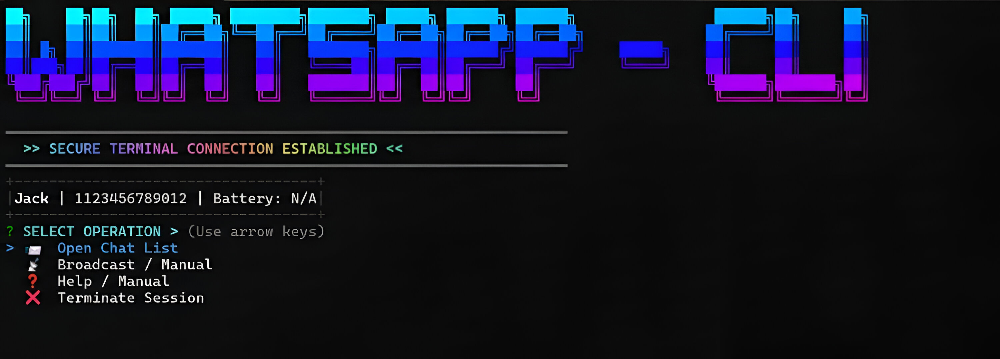

<div align="center">

  # WhatsApp CLI

  [](https://www.npmjs.com/package/whatsapp-cli-pro)
  [](https://opensource.org/licenses/MIT)
  [](https://nodejs.org)

  <p align="center">
    <b>The Ultimate Terminal-Based WhatsApp Client.</b><br>
    Experience messaging like a hacker with a cinematic interface, gradient aesthetics, and full keyboard interactivity.
  </p>

  <br>
  
  
  
  <br><br>

</div>

---

## Features

### Beautiful UI
* **Cinematic Boot Sequence:** Sci-fi style initialization and loading effects.
* **Gradient Typography:** Beautiful ANSI shadow fonts (Cyan/Blue/Magenta) using `gradient-string`.
* **Dashboard:** Real-time user info and battery status in a boxed UI.

### Interactive UX
* **Live Contact List:** Select friends/groups using arrow keys.
* **Chat Room Mode:** View history and reply instantly inside a persistent chat session.
* **Modular Architecture:** Built with a clean `src/` structure for easy contribution.

### System Integration
* **Desktop Notifications:** Get native pop-ups when a new message arrives.
* **Global Command:** Run `whatsapp-cli` from anywhere in your terminal.

---

## Installation

### Option 1: NPM Global (Recommended)
Install instantly via NPM Registry:

```bash
npm install -g whatsapp-cli-pro

```

Then simply run:

```bash
whatsapp-cli

```

### Option 2: For Developers (Git Clone)

If you want to contribute or modify the source code:

```bash
# 1. Clone the repository
git clone [https://github.com/Lutzvex/whatsapp-cli.git](https://github.com/Lutzvex/whatsapp-cli.git)

# 2. Install dependencies
cd wa-cli-pro
npm install

# 3. Link command locally
npm link

# 4. Run
whatsapp-cli

```

---

## Architecture

This project uses a modular structure:

```text
wa-cli-pro/
├── src/
│   ├── config/    # Theme & Color settings
│   ├── features/  # Chat & Menu logic
│   ├── ui/        # Banner & Boot sequence
│   └── utils/     # Helper functions
├── index.js       # Entry point
└── package.json

```

---

## Disclaimer

This project is for **Educational Purposes Only**.
It is an unofficial client based on `whatsapp-web.js`. Use at your own risk.

---

<div align="center">
Created by <b>Jack Williams</b>


<i>"Code is Poetry"</i>
</div>